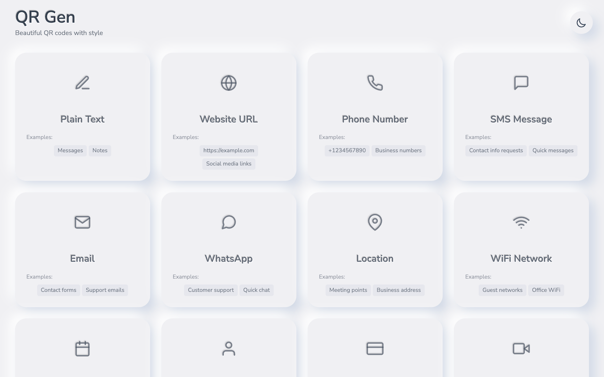
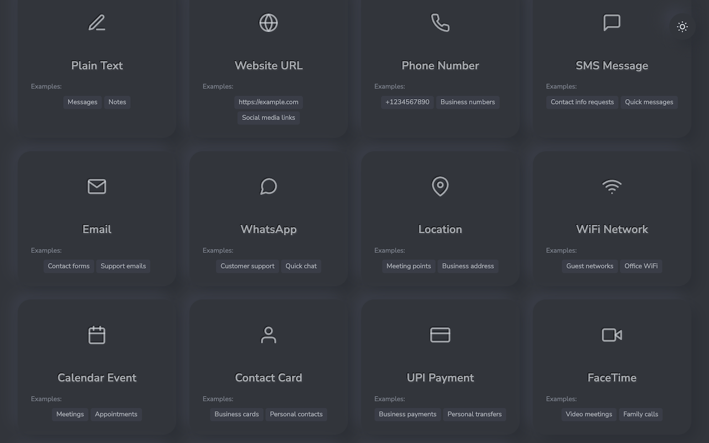
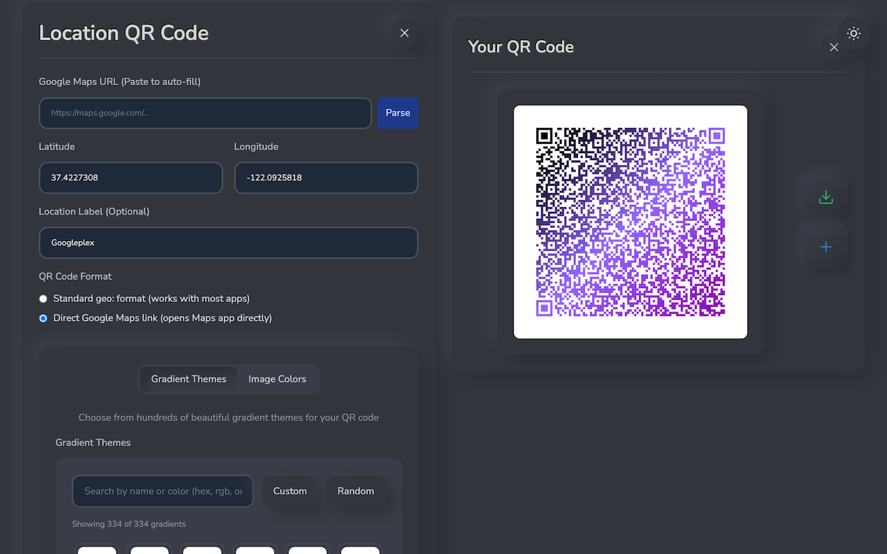

# QR Gen - Professional QR Code Generator

⚡ **Create beautiful QR codes instantly** - A powerful Chrome extension for generating professional QR codes with embedded images, smart color extraction, and modern neumorphic design.


## 📱 Screenshots

### Light Mode Interface

*Complete QR code type selection interface with modern neumorphic design*

### Dark Mode Interface  

*Dark mode showing all supported QR code types: Plain Text, URL, Phone, SMS, Email, WhatsApp, Location, WiFi, Calendar Events, Contact Cards, UPI Payments, and FaceTime*

### Advanced Location QR Code Generation

*Advanced location QR code generation with Google Maps integration, custom gradients, and real-time preview*

## ✨ Features

### 🎯 Multiple QR Code Types
- **📝 Plain Text** - Messages, notes, quotes, any text content
- **🌐 Website URLs** - Direct links to websites and web pages
- **📞 Phone Numbers** - Instant dial functionality for calls
- **💬 SMS Messages** - Pre-filled text messages with custom content
- **📧 Email** - Pre-composed emails with recipient, subject, and body
- **📱 WhatsApp** - Direct WhatsApp messaging with phone numbers
- **📍 Location** - GPS coordinates and Maps integration
- **📶 WiFi Networks** - Instant WiFi connection sharing
- **📅 Calendar Events** - Add events to calendar with details
- **👤 Contact Cards** - Complete vCard format contact information
- **💳 UPI Payments** - Indian digital payments (UPI format)
- **📲 FaceTime** - Apple FaceTime video call links
- **💼 LinkedIn** - Professional LinkedIn profile links with smart formatting
- **📸 Instagram** - Instagram profile QR codes compatible with IG app
- **👻 Snapchat** - Snapchat profile links with custom branding

### 🎨 Visual Design
- **Neumorphism Interface** - Modern, tactile design with soft shadows
- **Dark Mode Support** - Automatic theme detection with manual toggle
- **Professional Typography** - Nunito Sans font optimized for readability
- **React Icons** - Consistent, scalable Feather icons
- **Responsive Layout** - Works on all screen sizes

### 🖼️ Image & Color Features
- **Image Embedding** - Add logos or images to QR codes (20% size ratio)
- **Smart Color Extraction** - Automatically extract dominant colors from images
- **Dynamic Coloring** - QR codes adapt to image colors intelligently
- **Custom Gradient Creator** - Create custom gradients with up to 3 colors and adjustable angles
- **1500+ Preset Gradients** - Beautiful curated gradient collection for instant use
- **Gradient Background Options** - Stunning gradients when no image is embedded
- **High Error Correction** - Level 'H' for reliable scanning with embedded images

### 🚀 User Experience
- **3-Step Wizard** - Simple Select → Configure → Generate workflow
- **Real-time Validation** - Instant feedback on input errors with smart URL formatting
- **Smart URL Formatting** - Auto-formats social media usernames and URLs for compatibility
- **Toast Notifications** - User-friendly success/error messages with inverted color themes
- **Tooltip Help** - Contextual information for all features and options
- **Keyboard Navigation** - ESC key support and full accessibility compliance
- **One-Click Download** - High-quality PNG export (400x400px)
- **Responsive Interface** - Toggle between preset gradients and custom creator
- **Professional Footer** - Copyright, license, disclaimer, and contribution support

## 🛠️ Installation

### From Chrome Web Store
[Install QR Gen](https://chrome.google.com/webstore/detail/YOUR_EXTENSION_ID) (Coming Soon)

### Manual Installation (Development)

1. **Download the Extension**
   - Clone this repository or download the ZIP file
   - Extract to your desired location

2. **Build the Extension**
   ```bash
   npm install
   npm run build
   ```

3. **Load in Chrome**
   - Open Chrome and navigate to `chrome://extensions/`
   - Enable "Developer mode" (toggle in top-right)
   - Click "Load unpacked"
   - Select the `build/` directory from the project
   - The extension icon will appear in your toolbar

4. **Start Using**
   - Click the QR Code Generator icon in Chrome toolbar
   - The extension opens in a new tab for the best experience

### For Developers

```bash
# Clone the repository
git clone <repository-url>
cd qr-code-generator

# Install dependencies
npm install

# Start development server
npm run dev

# Build for production
npm run build

# Publishing scripts
npm run prepare-release     # Interactive release preparation
npm run build:zip          # Build and create extension zip
npm run validate:extension # Run all checks and build

# Code quality
npm run typecheck
npm run lint
npm run format
```

## 🚀 Publishing

### Automatic Publishing (GitHub Actions)
1. Set up Chrome Web Store API credentials (see `scripts/setup-store-api.md`)
2. Configure GitHub secrets:
   - `CHROME_EXTENSION_ID`
   - `CHROME_CLIENT_ID`
   - `CHROME_CLIENT_SECRET`
   - `CHROME_REFRESH_TOKEN`
3. Create a release or use workflow dispatch in GitHub Actions

### Manual Publishing
```bash
# Prepare a new release
npm run prepare-release

# Or build and zip manually
npm run build:zip
```

## 🏗️ Technical Architecture

### Tech Stack
- **Frontend**: React 18 + TypeScript
- **Build Tool**: Vite 4.5+ with React plugin
- **Styling**: Tailwind CSS with custom neumorphism utilities
- **QR Generation**: qrious library
- **Color Analysis**: colorthief library
- **Icons**: React Icons (Feather)
- **Extension**: Chrome Manifest V3

### Project Structure

The project follows a clean architecture with all source code contained within the `src/` directory and configuration files organized in `config/`:

```
├── .github/                    # GitHub workflows and automation
│   └── workflows/
│       └── publish-extension.yml  # Chrome Web Store publishing workflow
├── config/                     # Build and tooling configuration
│   ├── vite.config.ts         # Vite build configuration
│   ├── tailwind.config.js     # Tailwind CSS configuration
│   └── postcss.config.js      # PostCSS configuration
├── src/                        # Complete source code directory
│   ├── assets/                 # Static assets
│   │   └── fonts/             # Nunito Sans font files
│   ├── components/            # React components
│   │   ├── forms/             # Form components for different QR types
│   │   ├── CustomGradientCreator.tsx  # Custom gradient creation
│   │   ├── GradientSelector.tsx       # Preset gradient selection
│   │   ├── QRCodeGenerator.tsx        # Main QR generation logic
│   │   ├── Footer.tsx                 # Application footer
│   │   └── ...
│   ├── hooks/                 # Custom React hooks
│   │   ├── useDarkMode.ts     # Theme management
│   │   ├── useToast.ts        # Notification system
│   │   ├── useGradients.ts    # Gradient management
│   │   └── useTooltip.ts      # Tooltip functionality
│   ├── utils/                 # Utility functions
│   │   ├── qrDataGenerator.ts # QR data formatting
│   │   ├── validation.ts      # Input validation
│   │   ├── colorUtils.ts      # Color extraction and processing
│   │   └── urlUtils.ts        # URL formatting utilities
│   ├── types/                 # TypeScript definitions
│   │   ├── index.ts           # Main type definitions
│   │   ├── qrious.d.ts        # QRious library types
│   │   └── colorthief.d.ts    # ColorThief library types
│   ├── constants/             # App constants
│   │   └── qrTypes.ts         # QR type definitions and gradients
│   ├── icons/                 # Extension icons (16, 32, 48, 128px)
│   ├── background.js          # Chrome extension service worker
│   ├── manifest.json          # Chrome extension manifest (Manifest V3)
│   ├── index.html             # Main HTML file
│   ├── index.tsx              # React application entry point
│   └── index.css              # Global styles + neumorphism utilities
├── scripts/                   # Development and publishing scripts
│   ├── prepare-release.sh     # Interactive release preparation
│   └── setup-store-api.md     # Chrome Web Store API setup guide
├── build/                     # Generated extension output (git-ignored)
│   ├── assets/                # Bundled JS and CSS files
│   ├── fonts/                 # Copied font files
│   ├── icons/                 # Extension icons
│   ├── background.js          # Service worker
│   ├── manifest.json          # Extension manifest
│   └── index.html             # Main HTML file
├── package.json               # Dependencies and scripts
└── tsconfig.json              # TypeScript configuration
```

### Clean Root Philosophy

The root directory contains only essential project files:
- **Package management**: `package.json`, `package-lock.json`
- **Documentation**: `README.md`, `RELEASES.md`, `REQUIREMENTS.md`
- **TypeScript configuration**: `tsconfig.json`
- **Build configuration**: `config/` directory with all tooling configs
- **Source code**: `src/` directory with all application code
- **Build output**: `build/` directory (generated, git-ignored)
- **Development scripts**: `scripts/` directory
- **GitHub workflows**: `.github/` directory

### Organized Configuration

All build and tooling configuration files are centralized in the `config/` directory:
- **`config/vite.config.ts`**: Vite build system configuration with Chrome extension file copying
- **`config/tailwind.config.js`**: Tailwind CSS framework configuration with neumorphism utilities
- **`config/postcss.config.js`**: PostCSS processing configuration for CSS optimization

All source code, assets, and extension-specific files are contained within `src/`, making the project structure clean and organized. The build process automatically copies necessary files from `src/` to `build/` for the final Chrome extension package.

### Key Features
- **Modular Architecture** - Separated concerns with custom hooks and utilities
- **Type Safety** - Comprehensive TypeScript coverage with custom type definitions
- **Responsive Design** - Mobile-first approach with Tailwind CSS neumorphism
- **Performance Optimized** - Vite bundling with code splitting and lazy loading
- **Accessible** - ARIA labels, keyboard navigation, and screen reader support
- **Custom Gradient Engine** - Advanced gradient creation with trigonometric calculations
- **Smart URL Processing** - Intelligent social media URL formatting and validation
- **Publishing Automation** - Complete GitHub Actions workflow for Chrome Web Store deployment

## 🎯 Usage Examples

### Basic Text QR Code
1. Click the extension icon
2. Select "Plain Text"
3. Enter your message
4. Click "Generate QR Code"
5. Download the result

### WiFi Sharing
1. Select "WiFi Network"
2. Enter network name (SSID)
3. Enter password
4. Choose encryption type
5. Generate and share the QR code

### Contact Card
1. Select "Contact Card"
2. Fill in name, phone, email
3. Add optional organization and website
4. Generate vCard QR code

### Image-Enhanced QR Code
1. Choose any QR type
2. Configure your data
3. Upload an image/logo
4. Colors are automatically extracted
5. Generate colorful QR code with embedded image

### Social Media QR Codes

#### LinkedIn Profile
1. Select "LinkedIn"
2. Enter your LinkedIn username or full URL
3. Smart formatting automatically handles various input formats:
   - `@johnsmith` → `https://www.linkedin.com/in/johnsmith`
   - `johnsmith` → `https://www.linkedin.com/in/johnsmith`
   - Full URL remains unchanged
4. Generate professional QR code with LinkedIn branding

#### Instagram Profile
1. Select "Instagram"
2. Enter username or profile URL
3. Creates QR codes compatible with Instagram app's native scanner
4. Auto-formats usernames for optimal compatibility

#### Snapchat Profile
1. Select "Snapchat"
2. Enter your Snapchat username
3. Smart URL formatting for Snapchat profile links
4. Custom Snapchat-themed gradient available

### Custom Gradient Creation
1. Select any QR type and configure data
2. In the gradient section, toggle to "Custom Gradient"
3. Choose up to 3 colors using color pickers
4. Adjust gradient angle (0-360 degrees) with intuitive slider
5. Real-time preview shows gradient changes
6. Trigonometric calculations ensure smooth gradient transitions

## 🔧 Configuration

### Content Security Policy
The extension includes a secure CSP that allows:
- Google Fonts for typography
- Local asset loading
- Image data URLs for QR generation

### Permissions
- **tabs** - Only permission required, used to open the extension in a new tab

## 🐛 Troubleshooting

### Common Issues

**QR Code won't scan:**
- Ensure good contrast between colors
- Try removing the embedded image
- Check if the data is too long for the QR code capacity

**Extension won't load:**
- Make sure you've run `npm run build`
- Check that Developer mode is enabled in Chrome
- Verify the build/ directory contains all files

**Fonts not loading:**
- Check internet connection (Google Fonts)
- Verify CSP allows font loading
- Clear browser cache

**Dark mode not working:**
- Check if system preference detection is enabled
- Try manually toggling the theme button
- Clear localStorage and refresh

## 🤝 Contributing

1. Fork the repository
2. Create a feature branch (`git checkout -b feature/amazing-feature`)
3. Make your changes
4. Run tests and linting (`npm run typecheck && npm run lint`)
5. Commit your changes (`git commit -m 'Add amazing feature'`)
6. Push to the branch (`git push origin feature/amazing-feature`)
7. Open a Pull Request

### Development Guidelines
- Use TypeScript for all new code
- Follow the existing component structure
- Add proper type definitions
- Test your changes thoroughly
- Follow the neumorphism design patterns

## 📝 License

This project is licensed under the MIT License - see the [LICENSE](LICENSE) file for details.

## 🙏 Acknowledgments

- **[qrious](https://github.com/neocotic/qrious)** - QR code generation
- **[colorthief](https://github.com/lokesh/color-thief)** - Color extraction
- **[React Icons](https://react-icons.github.io/react-icons/)** - Icon library
- **[Tailwind CSS](https://tailwindcss.com/)** - Styling framework
- **[Google Fonts](https://fonts.google.com/)** - Nunito Sans typography

## 📊 Stats

- **Bundle Size**: ~420KB JavaScript, ~52KB CSS (optimized with Vite)
- **QR Types Supported**: 15 different types including social media
- **Gradient Options**: 1500+ preset gradients + unlimited custom gradients
- **Image Formats**: PNG, JPG, GIF, WebP, SVG support
- **Output Format**: High-quality PNG (400x400px) with embedded images
- **Error Correction**: Level H (30% recovery) for reliable scanning
- **Social Media Integration**: Smart URL formatting for LinkedIn, Instagram, Snapchat
- **Custom Features**: Gradient angle control, color extraction, neumorphic design

---

**Made with ❤️ for the Chrome Web Store**

*Generate beautiful QR codes with style and intelligence.*